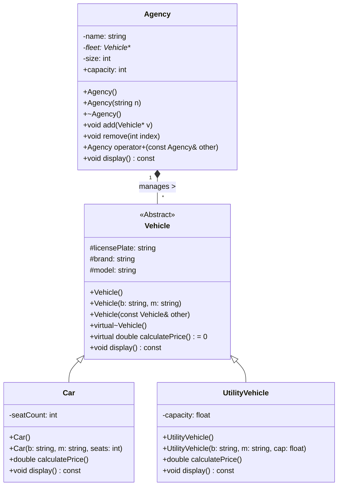
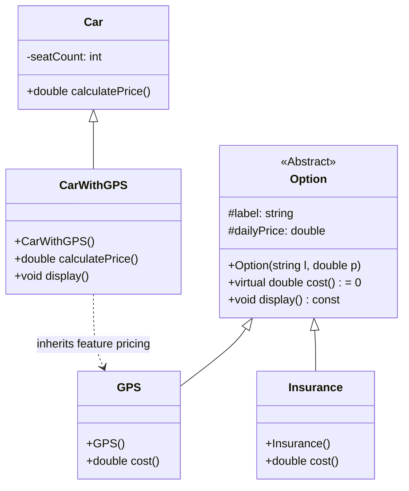

# 🚗 C++ Vehicle Rental & Options Management System

<div align="center">


**Object-Oriented Programming Project**

*Memory Management • Polymorphism • Multiple Inheritance • Operator Overloading*

</div>

---

## 📖 Table of Contents
1. [Project Overview](#project-overview)
2. [Exercise 1: Core Fleet Management](#exercise-1-core-fleet-management)
    - [Architecture & UML](#architecture--uml-exercise-1)
    - [Detailed Class Breakdown](#detailed-class-breakdown-exercise-1)
    - [Key Technical Explanations](#key-technical-explanations-exercise-1)
3. [Exercise 2: Options & Multiple Inheritance](#exercise-2-options--multiple-inheritance)
    - [Concept & Logic](#concept--logic-exercise-2)
    - [Architecture & UML](#architecture--uml-exercise-2)
4. [Global Implementation Details](#global-implementation-details)
5. [Compilation Guide](#compilation-guide)

---

## 📋 Project Overview

This project implements a comprehensive **Vehicle Rental Agency** system using modern C++. It is designed to demonstrate advanced Object-Oriented Programming (OOP) techniques required to build flexible and maintainable software.

The system is divided into two parts:
1.  **Exercise 1:** Establishes the core hierarchy using single inheritance and polymorphism to manage different types of vehicles.
2.  **Exercise 2:** Extends the functionality using **Multiple Inheritance** to handle rental options (like GPS or Insurance) that can be attached to vehicles dynamically.

---

## 📘 Exercise 1: Core Fleet Management

### 🎯 Objective
Create a system where an `Agency` can store different types of vehicles (`Car`, `UtilityVehicle`) in a single list and calculate their specific rental prices without knowing their exact type at compile time.

### 🏗️ Architecture & UML (Exercise 1)



### 📝 Detailed Class Breakdown (Exercise 1)

#### 1. `Vehicle` (The Abstract Base Class)
*   **Role:** Defines the contract (interface) that all vehicles must follow.
*   **Why Abstract?** It contains a **Pure Virtual Function** (`calculatePrice() = 0`). This means `Vehicle` cannot be instantiated directly; you must create a `Car` or `UtilityVehicle`.
*   **The Virtual Destructor (`virtual ~Vehicle()`):**
    *   *Crucial Detail:* When deleting an object via a pointer to the base class (e.g., `delete myVehiclePointer`), a non-virtual destructor would only call `Vehicle`'s destructor, leaking memory allocated by the `Car` or `UtilityVehicle` classes. Making it `virtual` ensures the correct destructor is called.

#### 2. `Car` and `UtilityVehicle` (Concrete Classes)
*   They inherit common data (`brand`, `model`) from `Vehicle`.
*   They implement `calculatePrice()` differently.
    *   *Polymorphism in Action:* The `Agency` can call `calculatePrice()` on a generic `Vehicle*`, and C++ automatically figures out whether to run the car's logic or the utility vehicle's logic at runtime.

#### 3. `Agency` (The Manager)
*   **Attribute `fleet` (Vehicle\*\*):** This is a dynamic array of **pointers**.
    *   *Explanation:* We use pointers (`Vehicle*`) rather than objects (`Vehicle`) to avoid **Object Slicing**. If we stored objects directly, the specific parts of `Car` (like `seatCount`) would be sliced off, leaving only the `Vehicle` part. Pointers preserve the full object.
*   **Memory Management:**
    *   **Constructor:** Allocates memory for the array of pointers.
    *   **Destructor:** Iterates through the array to delete each individual vehicle object, then deletes the array itself.
*   **`operator+` (Overloading):**
    *   Allows syntax like `Agency3 = Agency1 + Agency2`.
    *   **Logic:** It creates a new `Agency`, adds all vehicles from the left operand, then adds all vehicles from the right operand, and returns the new agency.

---

## 📙 Exercise 2: Options & Multiple Inheritance

### 🎯 Objective
Allow vehicles to have optional features (e.g., GPS, Insurance) without creating a new class for every combination (e.g., `CarWithGPS`, `CarWithInsurance`, `CarWithGPSAndInsurance`).

### 💡 Concept & Logic (Exercise 2)

To solve the "combinatorial explosion" of classes, we use **Multiple Inheritance**.
*   A `CarWithGPS` **is a** `Car`.
*   A `CarWithGPS` **is a** `Option` (specifically, a GPS option).

This allows the system to treat the vehicle primarily as a `Vehicle` but pull pricing logic from the `Option` hierarchy as well.

### 🏗️ Architecture & UML (Exercise 2)



### 📝 Implementation Details (Exercise 2)

1.  **Class `Option`:** An abstract class that defines what an "option" looks like (a label and a price).
2.  **Derived Options (`GPS`, `Insurance`):** Implement specific prices (e.g., GPS adds $10/day).
3.  **Multiple Inheritance Class (`CarWithGPS`):**
    *   Defined as: `class CarWithGPS : public Car, public GPS`
    *   **Method `calculatePrice()`:** This method overrides the base version. It combines the base car price with the option price:
        ```cpp
        double CarWithGPS::calculatePrice() {
            return Car::calculatePrice() + GPS::cost();
        }
        ```
4.  **Polymorphic Compatibility:** Because `CarWithGPS` inherits from `Car` (which inherits from `Vehicle`), a `CarWithGPS` object can still be stored in the `Agency`'s `Vehicle**` array.

---

## ⚙️ Global Implementation Details

### The Pricing Logic
The power of this system is that the `Agency` does not need to know if a vehicle is a `Car`, a `UtilityVehicle`, or a `CarWithGPS`. It simply loops through its list:

```cpp
for (int i = 0; i < size; i++) {
    // The correct calculatePrice() is chosen automatically at runtime (Dynamic Binding)
    double price = fleet[i]->calculatePrice();
    cout << "Price: " << price << endl;
}
```

### Memory Safety Strategy
1.  **Deep Ownership:** The `Agency` owns the `Vehicle` objects. It is responsible for `new` (creation) and `delete` (destruction).
2.  **Rule of Three:** The `Agency` class implements a Copy Constructor and an Assignment Operator (or deletes them) to handle deep copying of the fleet, ensuring two agencies don't accidentally delete the same vehicle memory.

---

## 💻 Compilation Guide

### File Structure
*   `Vehicle.h` / `Vehicle.cpp` (Base class)
*   `Car.h` / `Car.cpp`
*   `UtilityVehicle.h` / `UtilityVehicle.cpp`
*   `Agency.h` / `Agency.cpp`
*   `Option.h` / `Option.cpp` (Exercise 2)
*   `GPS.h` / `GPS.cpp` (Exercise 2)
*   `main.cpp` (Test program)

### Compilation Commands
Compile all source files linking them together using a C++11 (or later) compiler.

**Using GCC (g++):**
```bash
g++ -o RentalSystem main.cpp Agency.cpp Vehicle.cpp Car.cpp UtilityVehicle.cpp Option.cpp GPS.cpp -std=c++11
```

**Execution:**
```bash
./RentalSystem
```

---

## 👤 Author
*   **Developed by:** [Youssef Lagmouch](https://github.com/Lagmouchyoussef/C-Car-Rental-Management-System/edit/main/README.md)
*   **GitHub:** [Lagmouchyoussef](https://github.com/Lagmouchyoussef)

---
